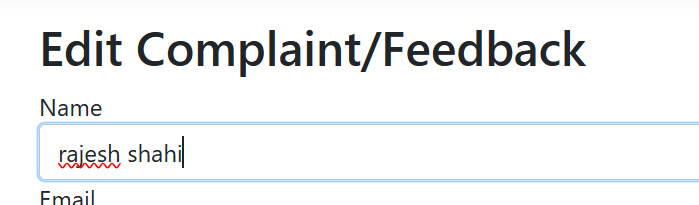

# Newton_Shahi_Thakuri_CRM_DOT_NET
Customer Relationship Management which consists of database for authentication and authorization as well as for complaints or feedbacks which records customer information. 
Dont forget to do the following before building:
**
Change server name in connection string 
add-migration migration-name
update-database 
**
In database:

INSERT INTO [dbo].[AspNetRoles]
           ([Id],[Name],[NormalizedName])
     VALUES
           ('43064954-d35d-49ef-9cf2-abe84345e891','User','USER'),
		   ('c87fa796-d513-4c1b-aef5-2bfd73e7a439','Manager','MANAGER')

Insert into AspNetUserRoles values
		   ('4ba40cf0-c224-43f9-9d16-406662ebcc56','c87fa796-d513-4c1b-aef5-2bfd73e7a439'),
		   ('888c4fbf-3649-4ac0-a71c-12e4bfccf63a','c87fa796-d513-4c1b-aef5-2bfd73e7a439'),
		   ('6876a6c7-e3be-4d44-8857-f619f27ce295','43064954-d35d-49ef-9cf2-abe84345e891'),
		   ('ac0d1466-9a7c-43f1-a360-06d75b30a739','43064954-d35d-49ef-9cf2-abe84345e891')

Replace user id by randomly generated id.

This is the homepage of web application made using .NET Core MVC that incorporates the following features: 
-Authentication
-Authorization
-CRUD operations
-pagination
-sorting
-searching

Firstly, this is the homepage of the web application.

After clicking the register button at the navigation bar it relocates for registration which doesnt need the actual email currently but must follow the actual email and password format.

The registered email can now login.

This is the privacy page (optional)

This is the page where list of customer complaints with customer information is listed. This is not accessible if user isn't logged in. This is implementation of authentication.
Pagination,sorting and searching is done here.

Complaints/Feedbacks can be added.

After submission, new Complaint/Feedback has now succesfully been added.

If your identity or account hasnt been given proper role, you cannot delete and will be prompted with this page.

If your identity or account has been give managerial role which has access to delete, you will be prompted with this page of confirmation. This is implementation of authorization.

After deletion, this is the list of information

This is the page of edit, which can change the existing informatoin of items in the list.

This can easily edit as seen the the image below.

In this way, Customer Relationship Management specifying Operational aspects has been created.